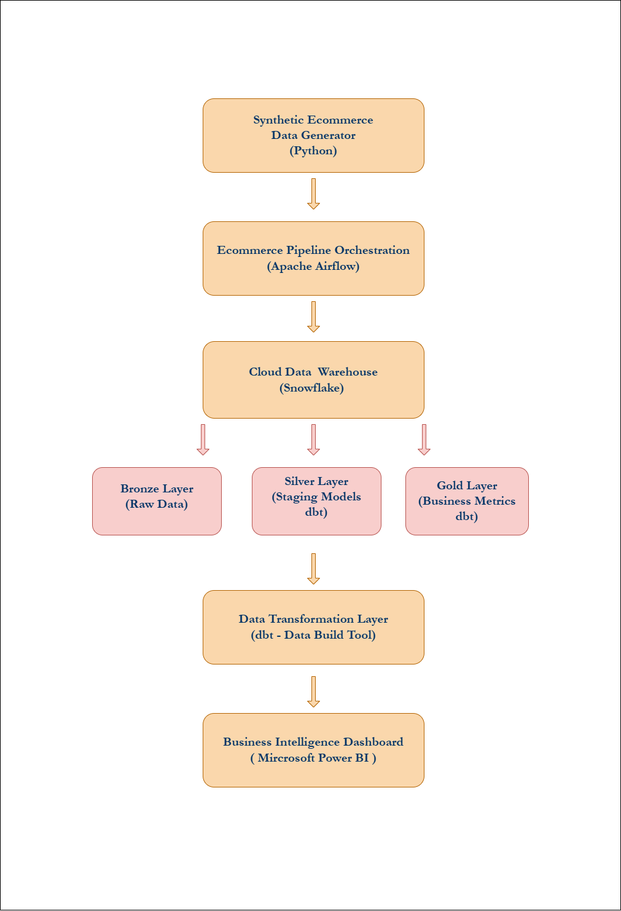
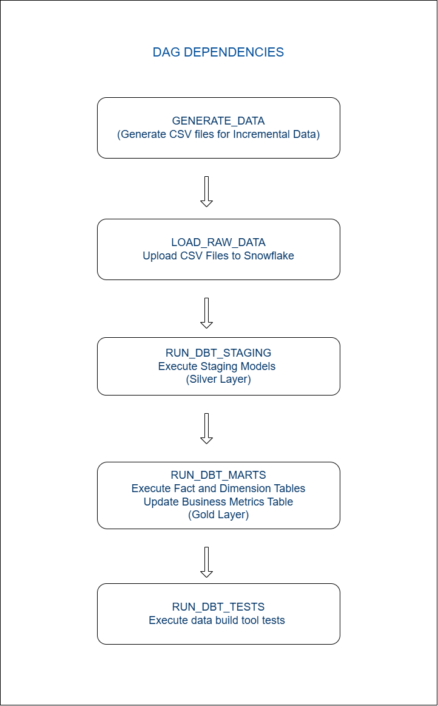

# End-to-End E-Commerce Data Engineering Pipeline (Scalable Architecture)

## Business Problem

Leadership teams rely on KPIs such as revenue, orders, and conversion rates.
However, inconsistent data processing across teams leads to unreliable reporting.

This project builds a scalable and centralized analytics pipeline that:

- Ingests raw e-commerce data
- Processes both small and large-scale datasets efficiently
- Transforms data into analytics-ready models
- Produces trusted business KPIs for decision-making

## Project Overview
This project simulates a real-world hybrid data pipeline, combining:

- Traditional warehouse-based transformations (dbt + Snowflake)
- Distributed data processing for large datasets (PySpark on AWS Glue)

The pipeline is designed to handle:

- Standard datasets using dbt
- High-volume datasets (5M+ records) using PySpark

---

# Architecture

Data Generation (Python)
        ↓
AWS S3 (Raw Data - Bronze Layer)

        ├── Branch A (Standard Data)
        │       ↓
        │   Snowflake
        │       ↓
        │   dbt (Staging → Marts → Metrics)
        │
        └── Branch B (Large Orders Dataset - 5M+)
                ↓
            AWS Glue (PySpark Processing)
                ↓
            AWS S3 (Processed Parquet - Silver Layer)
                ↓
            Snowflake (Load Processed Data)
                ↓
            dbt (Fact + Metrics Layer - Gold)
                ↓
            Power BI Dashboard

The warehouse follows a Medallion Architecture:

Bronze Layer → Raw Data  
Silver Layer → Cleaned/Staging Data  
Gold Layer → Analytics & Business Metrics

---

# Technologies Used

- Python – Data generation
- AWS S3 – Data lake storage (raw + processed)
- AWS Glue (PySpark) – Large-scale data processing
- Snowflake – Cloud data warehouse
- dbt – Data transformation & modeling
- Apache Airflow – Workflow orchestration
- Power BI – Dashboard visualization
- GitHub Actions – CI/CD for dbt pipelines
- AWS IAM – Access control

---

# Data Architecture (Medallion Model)

- Bronze Layer → Raw data stored in S3
- Silver Layer → Processed large datasets using PySpark (Parquet format)
- Gold Layer → Analytics-ready models in Snowflake via dbt

# Phase 1 – Data Generation

A Python script generates realistic e-commerce datasets.

Synthetic datasets generated using Python:

- Customers – 10,000 records
- Products – 500 records
- Orders – Incremental (daily batches)
- Payments – Transaction data
- Events – User activity (200,000 records)

Events simulate user activity such as:

- page_view  
- product_view  
- add_to_cart  
- checkout  

All datasets are exported as CSV files.

---

# Phase 2 – Data Loading to Warehouse / Data Ingestion - S3

The generated CSV files are uploaded to Snowflake stages and loaded into raw warehouse tables.

Bronze layer tables:

- bronze_customers
- bronze_products
- bronze_orders
- bronze_payments
- bronze_events

These tables store raw ingested data without transformation.

- While using AWS S3, All datasets are uploaded to AWS S3 (raw zone)
- Acts as centralized storage for pipeline input
- Organized using structured prefixes:
  
  - /raw/customers/
  - /raw/orders/
  - /raw/events/

---

# Phase 3A – Data Cleaning 

Using dbt staging models, raw data is cleaned and standardized.

Staging models:

- stg_customers
- stg_products
- stg_orders
- stg_payments
- stg_events

Transformations performed:

- Deduplication
- Null value handling
- Type casting
- Timestamp formatting
- Column renaming

This prepares the data for analytics modeling.

# Phase 3B – Large Scale Data Processing (PySpark)

A separate processing branch handles high-volume order data (~5M records).

PySpark (AWS Glue) responsibilities:
- Deduplication at scale
- Filtering invalid records
- Data type standardization
- Partitioning (e.g., by order_date)
- Conversion to Parquet format for optimized storage

Processed data is written to: 

S3 → /processed/orders/

### Data Loading to Snowflake

- Processed Parquet data is loaded into Snowflake tables
- Standard datasets are directly loaded from S3

---

# Phase 4 – Data Transformation using dbt

dbt is used for analytics modeling and business logic using star schema, not heavy processing.

Layers:
- Staging Layer
- Source alignment
- Light transformations
- Column standardization

Marts Layer:
- dim_customers
- dim_products
- fact_orders_small (standard pipeline)
- fact_orders_large (PySpark processed data)
  
Metrics Layer:
- Unified business metrics

---

# Phase 5 – Business Metrics Layer

A business metrics model calculates daily KPIs.

daily_business_metrics.sql generates:

- Order Date
- Total Orders
- Total Revenue
- Average Order Value
- Daily Active Users
- Conversion Rate
- Retention Rate

These metrics are used for monitoring business performance.

---

# Phase 6 – Data Quality Testing

Data validation is implemented using dbt tests.

Tests performed:

- Primary key uniqueness
- Null value checks
- Referential Integrity

Key columns tested include:

- customer_id
- order_id
- product_id

---

# Phase 7 – Pipeline Orchestration

The entire workflow is automated using Apache Airflow.

Airflow DAG stages:

DAG 1 - Standard Pipeline

1. Generate incremental datasets
2. Upload CSV data to Snowflake
3. Run dbt staging models
4. Run dbt fact models and Generate business metrics
5. Run dbt tests

Each DAG run processes incremental data, simulating real production pipelines.

DAG 2 - Large Data Pipeline

1. Upload 5M dataset to S3
2. Trigger AWS Glue PySpark job
3. Load processed data to Snowflake
4. Trigger dbt models for large dataset
5. Run dbt tests

---
# Phase 8 - CI/CD Pipeline (dbt)

CI/CD implemented using GitHub Actions:

- Trigger on code push
- Run dbt run
- Run dbt test

Ensures:

- Automated validation
- Consistent deployments
- Early detection of data issues
  
---

# Phase 9 – KPI Dashboard

A Power BI dashboard was built to visualize business metrics.KPI dashboards provide insights into:

- Revenue trends
- Conversion funnel
- Customer behavior
- Retention analysis

### Executive Overview

- Total Revenue
- Total Orders
- Average Order Value
- Daily Active Users
- Revenue Trend

### Conversion Analysis

- Conversion Funnel (Product View → Add to Cart → Checkout)
- Conversion Rate Trend

### Customer Behavior

- Customer Retention Rate Trend
- Revenue by Country

These dashboards help business teams track performance and user engagement.

---

# Key Design Decisions

- PySpark introduced only for high-volume data processing
- dbt used strictly for analytics modeling and metrics
- Shared dimension tables ensure data consistency across pipelines
- Separate pipelines improve scalability and maintainability

---

# Conclusion

This project demonstrates a scalable hybrid data architecture, combining:

- Distributed processing (PySpark)
- Cloud storage (AWS S3)
- Data warehousing (Snowflake)
- Analytics engineering (dbt)

It reflects how modern data teams handle both standard and large-scale data workloads efficiently.
